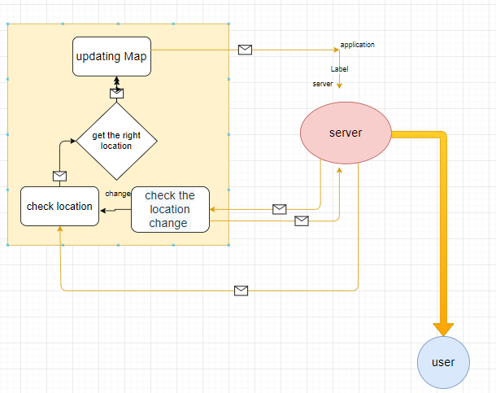

# City Explorer App

## Response Cycle

**Author**: Sa'ed Jabali

**Version**: 1.0.0

## Overview
<!-- Provide a high level overview of what this application is and why you are building it, beyond the fact that it's an assignment for this class. (i.e. What's your problem domain?) -->

## Getting Started

First creat react app and then install packeges.

## Architecture

This application shows the selected city (user selected) *location* on the map.
we used react to build this and styled it with bootstrap and used asiox for getting data from API
mainley we used JavaScript.

## Change Log
<!-- Use this area to document the iterative changes made to your application as each feature is successfully implemented. Use time stamps. Here's an example: -->

04-05-2021 4:00pm - Application now has a fully-functional with a GET route for the location resource.

## Credit and Collaborations

Credit goes to Murad Al-Shorman who was my partner in this lab.

## Time Estimates

Name of feature: plan an approach

Estimate of time needed to complete: 15 minutes

Start time: 2:00

Finish time: 2:30

Actual time needed to complete: 30 minutes

Name of feature: display map

Estimate of time needed to complete: 45 minutes

Start time: 3:00

Finish time: 4:30

Actual time needed to complete: 90 minutes

Name of feature: Connecting other API server to ours

Estimate of time needed to complete: 30 minutes.

Start time: 10 Pm

Finish time: 11 Pm

Actual time needed to complete: 60 minutes.

Name of feature: Adding weather API.

Estimate of time needed to complete: 40 minutes

Start time: 6 pm

Finish time: 7 pm

Actual time needed to complete: 60 minutes.

Name of feature: Adding movies API.

Estimate of time needed to complete: 40 minutes

Start time: 1 pm

Finish time: 3 pm

Actual time needed to complete: 2 hours.
